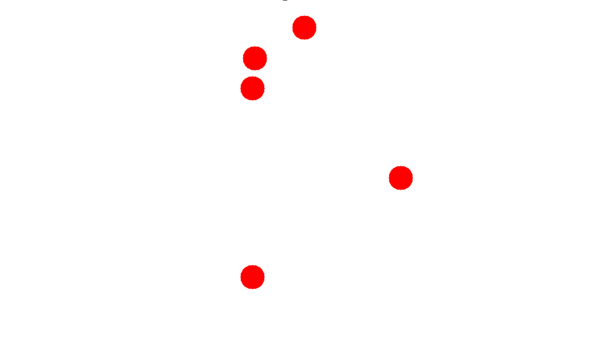

# Projectile Motion and Target Detection

This project calculates the initial conditions (velocity $v_0$ and angle $\theta$) required to hit fixed targets detected in an input image. It leverages OpenCV for target detection, numerical methods for solving projectile motion, and matplotlib for visualization through animations.

## Table of Contents
1. [Features](#features)
2. [Requirements](#requirements)
3. [Usage](#usage)
4. [Code Structure](#code-structure)
5. [Examples](#examples)
6. [Future Improvements](#future-improvements)

## Features
- **Target Detection**: Detect circular targets in an image using OpenCV's Hough Transform.
- **Numerical Methods**: Compute initial velocity and angle using the shooting method.
- **Animation**: Visualize projectile trajectories hitting targets.
- **Customizability**: Support for both image-based and manual target input.

## Requirements
Ensure the following dependencies are installed:
- Python 3.7+
- OpenCV (`cv2`)
- NumPy
- Matplotlib

Install them using:
```bash
pip install numpy opencv-python matplotlib
```

## Usage
### 1. Clone the Repository
```bash
git clone https://github.com/Nef3rp1tou/NP_FINAL_HIT_A_BALL.git

```

### 2. Run the Main Program
```bash
python main.py
```

### 3. Input Options
- **Image-Based Detection**:
  - Provide an image file containing circular targets.
  - The program detects targets and maps them to a grid.
- **Manual Input**:
  - Specify the number of targets and their grid coordinates manually.

### 4. Interactive Origin Selection
- Use your mouse to click on the grid and set the origin for the projectile.
- The program computes the trajectories and animates the motion.

## Code Structure
- **`main.py`**: Entry point of the program. Handles user inputs, target detection, and animation.
- **`detect_targets`**: Detect circular targets in an image using Gaussian blur and Hough Transform.
- **`shooting_method_2d`**: Numerically solve for initial velocity and angle to hit the target.
- **`Animator`**: Handle animations for visualizing projectile trajectories.

## Examples
### Example 1: Image-Based Target Detection
1. Provide an image with circular targets:
   
2. The program detects the targets and computes trajectories.
3. Animation visualizes projectiles hitting the targets.

### Example 2: Manual Input
1. Input grid size and specify targets manually.
2. Click on the grid to set the origin.
3. View calculated trajectories and animations.

## Future Improvements
- **Optimizations**: Speed up the shooting method with adaptive search strategies.
- **Noise Handling**: Improve target detection in noisy environments.
- **Realistic Physics**: Incorporate air resistance into motion calculations.

## Contact
For questions or feedback, please contact Gia Dvalishvili at [dvalishvili.gia@kiu.edu.ge].

